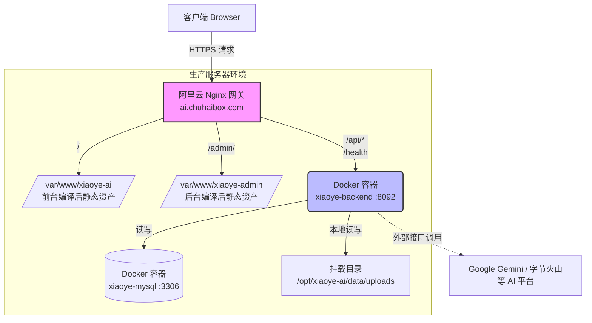

# 寻氧 AI 生产环境部署实录与排坑指南

本文档全面复盘了寻氧 AI（Xiaoye AI）在阿里云生产服务器（`8.140.214.182`）的完整部署历程。包含最终的网络架构图、踩坑实录以及对应的解决方案，可为后续的系统扩容与维护提供参考。

---

## 1. 系统部署架构

系统采用动静分离的设计：请求由 Nginx 作为统一网关进行拆分，静态资源命中本地文件系统，API 动态请求转交 Docker 容器池。



---

## 2. 核心部署流程复盘

### Step 1: 环境核查与敏感变量注入
最初排查服务器状态时发现 `.env.prod` 文件未补齐必需的安全令牌。
**操作**：通过 SSH 生成强随机密钥填补空缺，确保后端符合我们前置的安全加固（P0级别任务）要求。
```bash
# 自动生成 32 字节 Hash 写入环境变量
LICENSE_SECRET=$(openssl rand -hex 32)
echo "LICENSE_SECRET=$LICENSE_SECRET" >> .env.prod
```

### Step 2: 后端 Docker 镜像构建与脱困
服务器使用 `docker compose up -d --build` 构建 Go 镜像时，经历了数次阻断报错，核心问题集中在 Go 依赖与网络环境。

### Step 3: 前端轻量化部署与本地卸载
服务端在初始资源开销评估时发现异常的内存挤占：单核 2G 规格直接挂起。为应对前端构建压力并确保秒级上线，修改了打包策略。

### Step 4: Nginx 上游网关路由分离与上线
为适配双前端分离目录结构（`/` 和 `/admin/`）与同域 API（`/api`），使用一份集成了阿里云 HTTPS 密钥的特殊 Nginx 配置实现资源分发。

---

## 3. 部署踩坑总结及详细解决方案

### 坑点一：Go 模块依赖与 Alpine 镜像生态错配
**现象**：
构建后端容器时，终端疯狂打出：
`golang.org/x/oauth2@v0.35.0 requires go >= 1.24.0 (running go 1.23.12)`
而当时我的 Dockerfile 指定的是 `FROM golang:1.23-alpine`。之后我试图将基础镜像改为 `golang:1.24-alpine`，但由于国内云原生镜像站（TencentYun 等）未同步最新的 Dockerhub 1.24-alpine，导致 `Head manifest EOF` 拉取错误。

**解决方案**：
采用 **魔法工具链降维打击**。在 Dockerfile 保持使用本地已有缓存的 `1.23-alpine`，同时引入 `GOTOOLCHAIN=auto` 和国内代理：
```dockerfile
FROM golang:1.23-alpine
ENV GOPROXY=https://goproxy.cn,https://goproxy.io,direct
# 神奇的一行：允许旧的 go 环境运行时根据 go.mod 版本自动下载兼容的 Go 编译器版本套件！
ENV GOTOOLCHAIN=auto 
```
通过依赖 Goproxy，1.23 版框架在容器内自动补全并下载好了 1.25.0 的构建工具，完美绕过网络层面的镜像拉取封锁。

### 坑点二：云服务器 npm install 假死
**现象**：
服务器 `ps aux` 显示 `npm install` 占用 100% CPU，但进度长时间毫无存进卡住在 `idealTree` 节点，最终抛出进程意外终止（OOM / Timeout）。

**解决方案**：
放弃“在低配远程服务器上即时构建前台”的僵化流程。改为使用主工作机（Mac）进行环境注入型交叉编译：
```bash
# 本地注入生产域名直接打包！
cd frontend && VITE_API_DOMAIN=https://ai.chuhaibox.com npm run build
```
随后将生成的 `dist` 通过 `tar.gz` 压缩并通过 SSH 零消耗推送到云服务器的 `/var/www/` 进行解压。此方案让原定 10 分钟极其不稳定的编译过程降维成 1-2 秒的文件复制，实现了运维的最佳实践。

### 坑点三：Nginx 的 alias 与 proxy_pass 路径陷阱
**现象 1**：访问 `/admin`（或者刷新管理面板），页面空白或发生 404；访问 `/api/health` 莫名加载出 HTML 页面，返回了 HTTP 405。
* **原因**：Nginx 中的 `alias` 处理 `try_files` 时会导致路径相对于根错乱；`/api/` 的前缀如果不精确隔离，也会影响后端 API。
* **解决方案**：修改 Nginx 正则与斜杠分配：
   - 彻底将 api 后端指向独立端口。
   - Frontend 与 Admin 控制 `index.html` 兜底。

```nginx
location / {
    root /var/www/xiaoye-ai;
    try_files $uri $uri/ /index.html;
}

location /admin {
    alias /var/www/xiaoye-admin;
    try_files $uri $uri/ /index.html;
}

location /health {
    proxy_pass http://127.0.0.1:8092/health;
}
```

---

## 4. 后续日常发布指南 (SOP)

如果开发者需要进行日常的迭代部署，请参考以下标准化极简动作表：

#### 更新后端 API:
```bash
# 无需关心代码逻辑，让服务器接管构建
ssh root@8.140.214.182 "cd /opt/xiaoye-ai && git pull origin main && docker compose up -d --build"
```

#### 更新前端 UI:
```bash
# 取决于修改了哪一块：在本地机器打好对应包后，一行推送
# 以更新 user frontend 为例：
cd frontend
VITE_API_DOMAIN=https://ai.chuhaibox.com npm run build
tar -czf update.tar.gz dist/
scp update.tar.gz root@8.140.214.182:/root/
ssh root@8.140.214.182 "tar -xzf /root/update.tar.gz -C /root/ && cp -r /root/dist/* /var/www/xiaoye-ai/ && rm -rf /root/update.tar.gz /root/dist"
```
